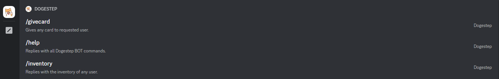

<h1 align="center">
   
  firecord-bot 
   
</h1>

<h3 align=center>A Discord Bot built using <a href=https://github.com/discordjs/discord.js>discord.js</a> !</h3>

  <a href="#about">About</a>
  •
  <a href="#Features">Features</a>

## About

A basic command bot that includes a variety of commands and a multitude of settings that can be used to fulfill any server's needs!

## Features

- Basic chat commands such as !ping, !hello, etc.
- Uses Firebase/Firestore as a database for storing user information and other data.

## Requirements

- Node.js
- Discord.js
- Firebase/Firestore

## Installation

1. Clone this repository
2. Run `npm install` to install the required dependencies
3. Create a new Firebase/Firestore project and add your configuration information to the `config.json` file.
4. Create a new bot on Discord and add the token to the `config.json` file
5. Run the bot with `node index.js`

## Commands

- !ping - returns "Pong!"
- !hello - returns "Hello!"
- Additional commands can be added in the `commands` folder

## Contributions

Feel free to fork this repository and submit pull requests for any new features or bug fixes.
